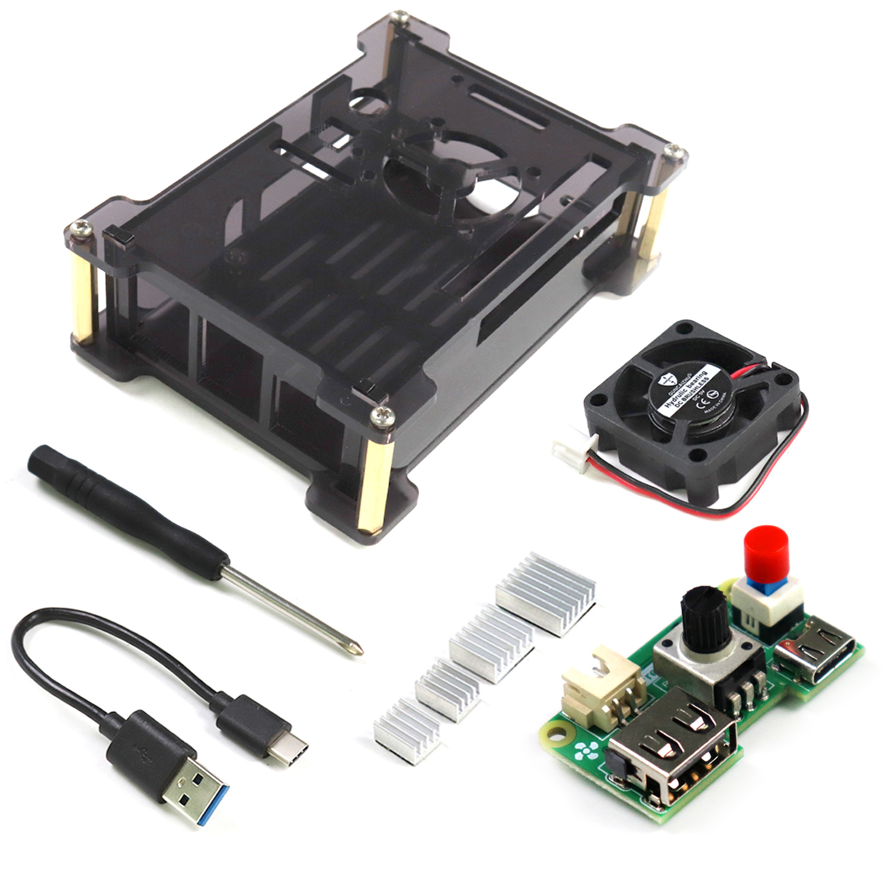
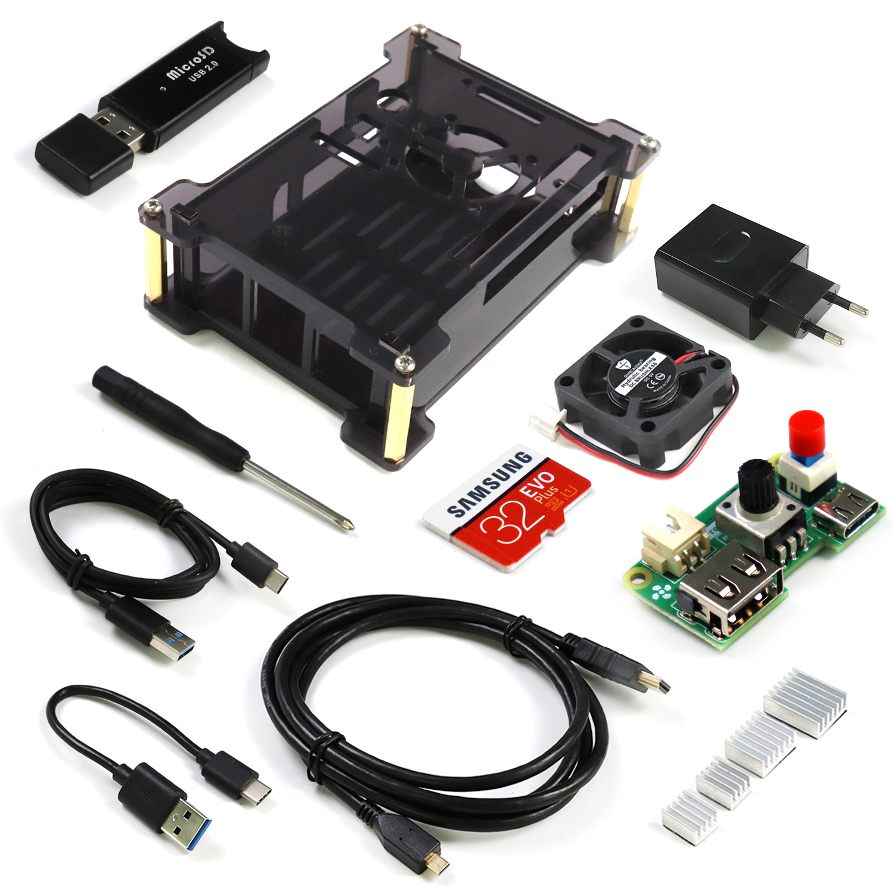
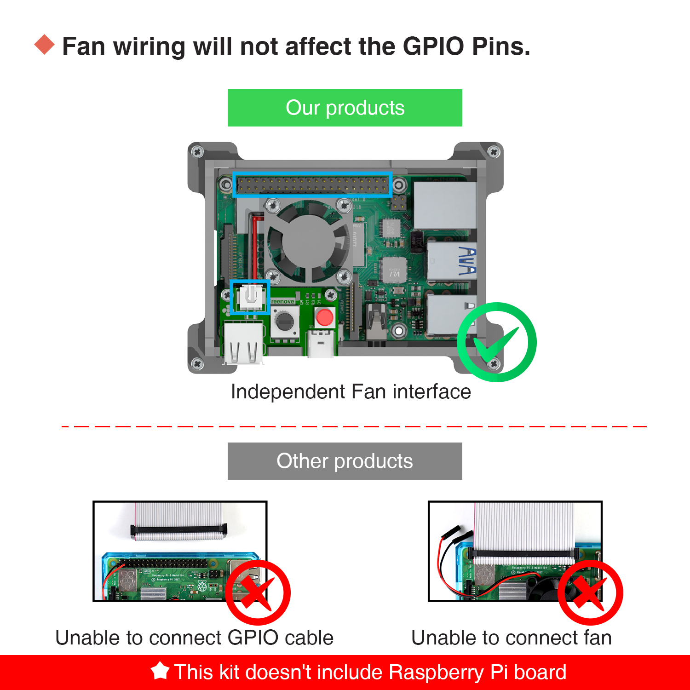

# Freenove Starter Kit for Raspberry Pi 4b
### The tutorial is applied for following kits:
Freenove Case Kit for Raspberry Pi 4b | Freenove Starter Kit for Raspberry Pi 4b                
---|---
 |                                      

## How to download
Please click the green "Clone or download" button, then click "Download ZIP" button in the pop-up window to download the zip file that contains all these files. Clicking the "Open in Desktop" button will lead you to install Github software instead of downloading these files. 
 If you have any difficulties, please send email to our support for help.

## Description
### Freenove Raspberry Pi starter or case kit
Both kits include Acrylic case, heat sink and cooling fan to protect the Raspberry Pi and solve heat problems.
Compared to other products on the market, we have a Power Fan board, which provides independent port for Fan. So Fan will not occupy the GPIO port of Raspberry Pi. 
And it integrates a power switch and a fan speed adjust potentiometer.
</img>
### This tutorial includes two parts.
 Part 1, Assemble Case and Set Up Raspberry Pi
 This part is for Freenove Raspberry Pi starter or case kit. It will introduce how to assemble the case and setup your Raspberry Pi to get it work.
 Part 2, Raspberry Pi Projects
 This part is for Raspberry Pi projects. If you have some eletronic compoents or Freenove Ultimate Starter Kit for Raspberry Pi. You can learn this part to creat interestibng Raspberry Pi projects.

## Support
* Freenove provides free and quick technical support, including but not limited to:
    * Quality problems of products
    * Problems in using products
    * Questions for learning and technology
    * Opinions and suggestions
    * Ideas and thoughts

* Please send email to:
    * support@freenove.com
 On working day, we usually reply to you within 24 hours.

## Copyright
 Freenove reserves all rights to the files for this product. No copies or plagiarizations are allowed for the purpose of commercial use. 
 The code and circuit involved in this product are released as Creative Commons Attribution ShareAlike 3.0 (http://creativecommons.org/licenses/by-sa/3.0/legalcode). This means you can use them on your own derived works, in part or completely, as long as you also adopt the same license. 
 Freenove brand and Freenove logo are copyright of Freenove Creative Technology Co., Ltd and cannot be used without formal permission.

## About
* Freenove is an open-source electronics platform. Freenove is committed to helping customer quickly realize the creative idea and product prototypes, making it easy to get started for enthusiasts of programing and electronics and launching innovative open source products. Our services include:
    * Electronic components and modules
    * Learning kits for Arduino
    * Learning kits for Raspberry Pi
	* Learning kits for micro:bit
    * Learning kits for Technology
    * Robot kits
    * Auxiliary tools for creations

* Our code and circuit are open source. You can obtain the details and the latest information through visiting the following web sites:
    * http://www.freenove.com
    * https://github.com/freenove

* Your comments and suggestions are warmly welcomed, please send them to the following email address:
    * support@freenove.com

